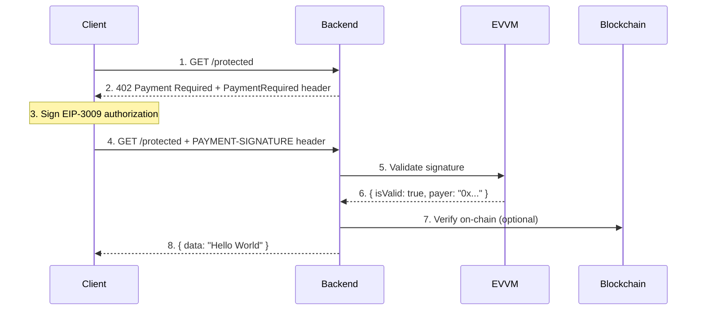
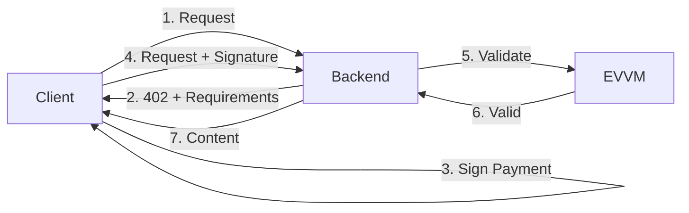

# x402 Demo

A demonstration of the [x402 payment protocol](https://x402.org) using EVVM for native payment processing.

## Architecture



## Projects

| Project | Port | Description |
|---------|------|-------------|
| **backend** | 3000 | Nitro server with EVVM for native payment processing |
| **client** | 5173 | React frontend for making x402 payments |

## Quick Start

### Backend (EVVM)

```bash
cd backend
npm install
npm run dev
```

### Client (Frontend)

```bash
cd client
npm install
npm run dev
```

Open http://localhost:5173 in your browser.

## API Endpoints

### Backend (`:3000`)

| Method | Endpoint | Price | Description |
|--------|----------|-------|-------------|
| GET | `/protected` | Paid | Protected endpoint requiring x402 payment |
| GET | `/status` | Free | Server status and configuration |
| GET | `/health` | Free | Health check |

### Client (`:5173`)

The frontend provides a UI for:
- Connecting wallets (MetaMask, Rainbow, Coinbase Wallet, etc.)
- Viewing server status
- Making protected requests

## Prerequisites

1. Node.js 18+
2. A Web3 wallet (MetaMask, Rainbow, Coinbase Wallet, etc.)
3. Testnet tokens on **Ethereum Sepolia**:
   - **ETH** for gas fees
   - **USDC** for payments

### Get Testnet Tokens

| Token | Faucet |
|-------|--------|
| **ETH** | [Alchemy Faucet](https://www.alchemy.com/faucets/ethereum-sepolia) |
| **USDC** | [Circle Faucet](https://faucet.circle.com/) → Select "Ethereum Sepolia" |

## Network Configuration

| Parameter | Value |
|-----------|-------|
| **Chain** | Ethereum Sepolia (testnet) |
| **Network ID** | `eip155:11155111` |
| **Token** | USDC |
| **Token Address** | `0x1c7D4B196Cb0C7B01d743Fbc6116a902379C7238` |
| **Price per request** | 0.1 USDC |

## How x402 Works



### Payment Flow

1. **Client** requests a protected resource (`GET /protected`)
2. **Backend** responds with `402 Payment Required` + payment requirements
3. **Client** signs an EIP-3009 authorization (gasless signature)
4. **Client** retries the request with the `PAYMENT-SIGNATURE` header
5. **Backend** validates the signature using EVVM
6. **Backend** serves the protected content

### Why EIP-3009?

- **Gasless for users**: Client only signs, doesn't pay gas
- **Atomic payments**: Payment and content delivery are linked
- **Secure**: Uses typed data signatures (EIP-712)

## Project Structure

```
x402-demo/
├── backend/                  # Port 3000
│   ├── server/
│   │   ├── routes/           # API routes
│   │   ├── middleware/       # x402 payment middleware
│   │   ├── utils/            # Helper functions
│   │   └── types/            # TypeScript types
│   ├── nitro.config.ts       # Nitro configuration
│   ├── package.json
│   └── README.md
├── client/                   # Port 5173
│   ├── src/
│   │   ├── components/       # React components
│   │   ├── hooks/            # Custom hooks (useX402, useEVVM)
│   │   ├── providers/        # Web3 provider
│   │   └── types/            # TypeScript types
│   ├── package.json
│   └── README.md
└── README.md
```

## Resources

- [x402 Specification](https://github.com/coinbase/x402)
- [x402 Documentation](https://docs.cdp.coinbase.com/x402/welcome)
- [x402.org](https://x402.org)
- [EVVM Documentation](https://github.com/evmvm/evvm-js)
- [EIP-3009: Transfer With Authorization](https://eips.ethereum.org/EIPS/eip-3009)
- [Circle USDC Faucet](https://faucet.circle.com/)

## License

Apache-2.0
