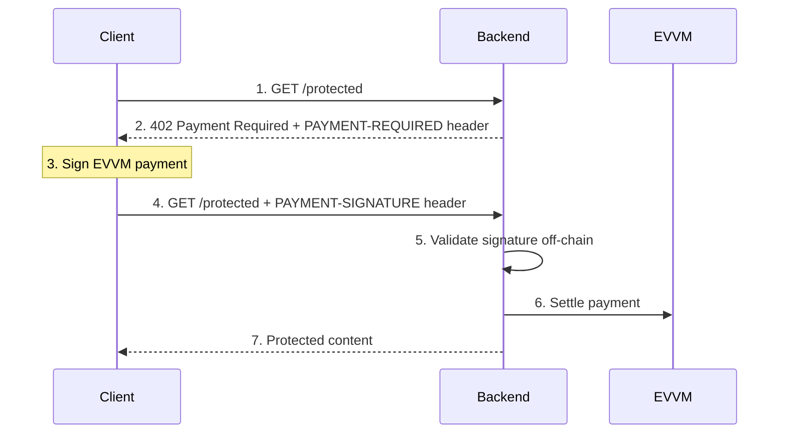
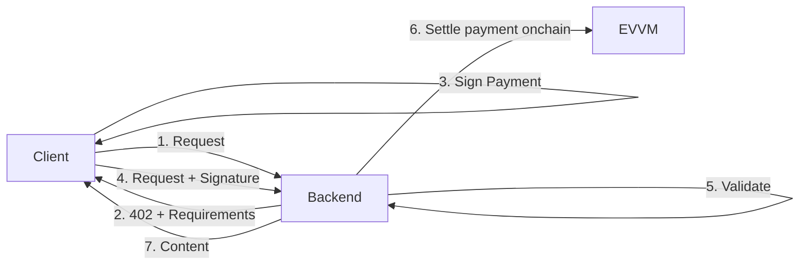

# x402 Demo

A demonstration of the [x402 payment protocol](https://x402.org) using EVVM for native payment processing.

## Architecture



## Projects

| Project | Port | Description                                          |
| ------- | ---- | ---------------------------------------------------- |
| backend | 3000 | Nitro server with EVVM for native payment processing |
| client  | 5173 | React frontend for making x402 payments              |

## Quick Start

### Backend (EVVM)

```bash
cd backend
npm install
npm run dev
```

### Client (Frontend)

```bash
cd client
npm install
npm run dev
```

Open http://localhost:5173 in your browser.

## API Endpoints

### Backend (`:3000`)

| Method | Endpoint     | Price | Description                               |
| ------ | ------------ | ----- | ----------------------------------------- |
| GET    | `/protected` | Paid  | Protected endpoint requiring x402 payment |
| GET    | `/status`    | Free  | Server status                             |

## Prerequisites

1. Node.js 18+
2. A Web3 wallet (MetaMask, Rainbow, Coinbase Wallet, etc.)
3. Testnet tokens on **Ethereum Sepolia**:
   - **ETH** for gas fees (paid by facilitator)
   - **MATE** for payments

### Get Testnet Tokens

Get testnet tokens from the [EVVM Faucet](https://evvm.dev).

## Network Configuration

| Parameter             | Value                                        |
| --------------------- | -------------------------------------------- |
| **Chain**             | Ethereum Sepolia (testnet)                   |
| **Network ID**        | `eip155:11155111`                            |
| **Token**             | MATE                                         |
| **Token Address**     | `0x0000000000000000000000000000000000000001` |
| **Price per request** | 0.1 MATE                                     |

## How x402 Works



### Payment Flow

1. **Client** requests a protected resource (`GET /protected`)
2. **Backend** responds with `402 Payment Required` + payment requirements
3. **Client** signs an EVVM payment authorization (off-chain, gasless)
4. **Client** retries the request with the `PAYMENT-SIGNATURE` header
5. **Backend** validates the signature using EVVM (off-chain)
6. **Backend** serves the protected content

### Key Features

- **Gasless for users**: Client only signs, doesn't pay gas
- **Off-chain validation**: EVVM validates signatures without on-chain calls
- **Facilitator pays gas**: Gas fees are covered by the facilitator
- **EVVM scheme**: Uses EVVM for payment validation

## Project Structure

```
x402-demo/
├── backend/                  # Port 3000
│   ├── server/
│   │   ├── routes/           # API routes
│   │   ├── middleware/       # x402 payment middleware
│   │   ├── utils/            # Helper functions
│   │   └── types/            # TypeScript types
│   ├── nitro.config.ts       # Nitro configuration
│   ├── package.json
│   └── README.md
├── client/                   # Port 5173
│   ├── src/
│   │   ├── components/       # React components
│   │   ├── hooks/            # Custom hooks (useX402, useEVVM)
│   │   ├── providers/        # Web3 provider
│   │   └── types/            # TypeScript types
│   ├── package.json
│   └── README.md
└── README.md
```

## Resources

- [x402 Specification](https://github.com/coinbase/x402)
- [x402 Documentation](https://docs.cdp.coinbase.com/x402/welcome)
- [x402.org](https://x402.org)
- [EVVM Documentation](https://evvm.info)
- [EVVM Faucet](https://evvm.dev)
