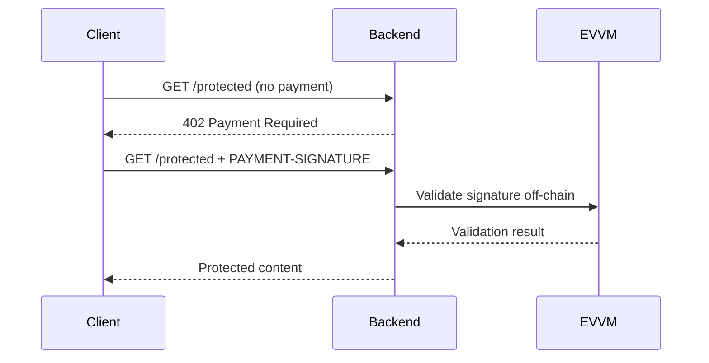

# x402 EVVM Backend

An x402 payment server built with Nitro that uses the EVM-compatible Virtual Machine (EVVM) for payment processing.

## Stack

- [Nitro](https://nitro.build) - Server framework
- [@evvm/evvm-js](https://github.com/evmvm/evvm-js) - EVM-compatible Virtual Machine in JavaScript
- [@x402/core](https://github.com/coinbase/x402) - x402 protocol implementation
- [viem](https://viem.sh) - Ethereum interactions

## Architecture

This backend implements x402 payments using the EVVM, which allows for EVM bytecode execution in a JavaScript environment. The EVVM validates signatures off-chain, and gas fees are covered by a facilitator.



## Endpoints

| Method | Path | Price | Description |
|--------|------|-------|-------------|
| GET | `/protected` | Paid | Protected endpoint requiring x402 payment |
| GET | `/status` | Free | Server status and configuration |

## Configuration

Create a `.env` file:

```bash
# .env
PORT=3000
# Add your configuration options here
```

## Running

```bash
# Install dependencies
npm install

# Development with hot reload
npm run dev

# Build for production
npm run build

# Start production server
npm run preview
```

## How It Works

### Payment Flow

1. Client requests `/protected` without payment
2. Server responds with `402 Payment Required` + x402 payment requirements
3. Client signs an EVVM payment authorization (off-chain, gasless)
4. Client retries with `PAYMENT-SIGNATURE` header
5. Server validates the signature using EVVM (off-chain)
6. If valid, serves protected content

### EVVM Integration

The backend uses `@evvm/evvm-js` to execute EVM bytecode for payment validation. This allows:
- Off-chain signature validation (no on-chain calls needed)
- Testing payment logic without mainnet costs
- Gasless payments for users (facilitator covers gas)
- Running EVM contracts in a JavaScript environment

### EVVM Scheme

This implementation uses the EVVM scheme (not EIP-3009):
- Signatures are validated off-chain using the EVVM
- Balance checks are performed against the EVVM state
- Gas fees are covered by a facilitator
- Users don't need ETH for transactions

## Project Structure

```
backend/
├── server/
│   ├── routes/
│   │   ├── index.ts          # Main routes
│   │   ├── protected/        # Protected endpoints
│   │   └── status/           # Status endpoint
│   ├── middleware/           # x402 payment middleware
│   ├── utils/                # Helper functions
│   └── types/                # TypeScript types
├── nitro.config.ts           # Nitro configuration
├── package.json
└── tsconfig.json
```

## Related Projects

- [client/](../client) - React frontend for making payments

## Resources

- [x402 Specification](https://github.com/coinbase/x402)
- [EVVM Documentation](https://github.com/evmvm/evvm-js)
- [Nitro Docs](https://nitro.build)
- [EVVM Faucet](https://evvm.dev)
