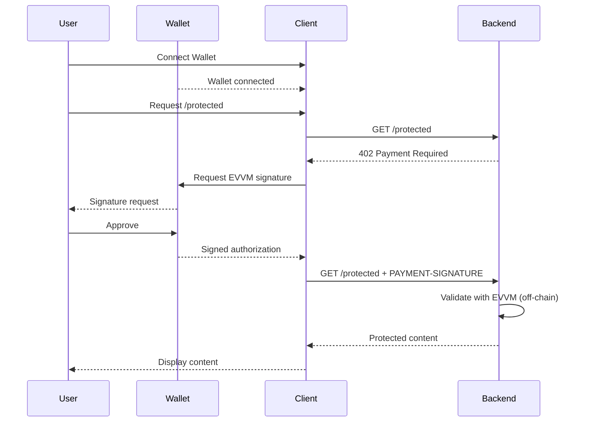

# x402 Client

A React frontend application for making x402 payments. Connect your wallet and pay for protected content using the x402 payment protocol.

## Stack

- [React](https://react.dev) - UI framework
- [Vite](https://vitejs.dev) - Build tool
- [Wagmi](https://wagmi.sh) - Ethereum wallet hooks
- [RainbowKit](https://www.rainbowkit.com) - Wallet connection UI
- [viem](https://viem.sh) - Ethereum interactions
- [Tailwind CSS](https://tailwindcss.com) - Styling

## Features

- Wallet connection (MetaMask, Rainbow, Coinbase Wallet, etc.)
- Automatic x402 payment handling
- Multi-chain support (Ethereum, Polygon, Base, Optimism, etc.)
- EVVM payment signature signing (off-chain, gasless)
- Protected content access after payment
- Balance fetching from EVVM

## Getting Started

### Installation

```bash
npm install
```

### Configuration

Create a `.env` file based on `.env.example`:

```bash
cp .env.example .env
```

Configure your environment variables:

```bash
VITE_WALLET_CONNECT_PROJECT_ID=your_project_id
```

### Development

```bash
npm run dev
```

Open http://localhost:5173 in your browser.

### Build

```bash
npm run build
```

### Preview Production Build

```bash
npm run preview
```

## How It Works

### Payment Flow

1. User connects their wallet
2. User requests protected content from the backend
3. Backend returns `402 Payment Required` with payment requirements
4. App detects the 402 response and extracts payment requirements
5. User signs an EVVM payment authorization (off-chain, gasless)
6. App retries the request with the payment signature
7. Backend validates the signature using EVVM (off-chain)
8. Backend serves the protected content



## Project Structure

```
client/
├── src/
│   ├── components/           # React components
│   │   └── JsonViewer.tsx    # JSON display component
│   ├── hooks/                # Custom React hooks
│   │   ├── useX402.ts        # x402 payment handling
│   │   └── useEVVM.ts        # EVVM utilities
│   ├── providers/            # React context providers
│   │   └── Web3Provider.tsx  # Wallet provider
│   ├── types/                # TypeScript types
│   │   ├── payment-required-payload.types.ts
│   │   ├── payment-payload.types.ts
│   │   └── evvm-schema.types.ts
│   ├── App.tsx               # Main app component
│   ├── main.tsx              # Entry point
│   └── index.css             # Global styles
├── package.json
├── vite.config.ts
└── tsconfig.json
```

## x402 Hook

The `useX402` hook handles the payment flow automatically:

```typescript
const { status, content, error, paymentDetails, fetchProtectedAsset } = useX402();

const handleRequest = async () => {
  await fetchProtectedAsset('http://localhost:3000/protected');
  // status: 'success' when content is available
};
```

## Wallet Requirements

To make payments, you need:

1. A Web3 wallet (MetaMask, Rainbow, Coinbase Wallet, etc.)
2. Testnet tokens on **Ethereum Sepolia**:
   - **MATE** for payments (get from EVVM faucet)
   - No ETH needed for gas (facilitator covers it)

### Getting Test Tokens

Get testnet tokens from the [EVVM Faucet](https://evvm.dev).

## Environment Variables

| Variable | Description |
|----------|-------------|
| `VITE_WALLET_CONNECT_PROJECT_ID` | WalletConnect project ID (required for WalletConnect) |

## Related Projects

- [backend/](../backend) - Nitro + EVVM server

## Resources

- [x402 Specification](https://github.com/coinbase/x402)
- [Wagmi Documentation](https://wagmi.sh)
- [RainbowKit Documentation](https://www.rainbowkit.com)
- [EVVM Documentation](https://github.com/evmvm/evvm-js)
- [EVVM Faucet](https://evvm.dev)
